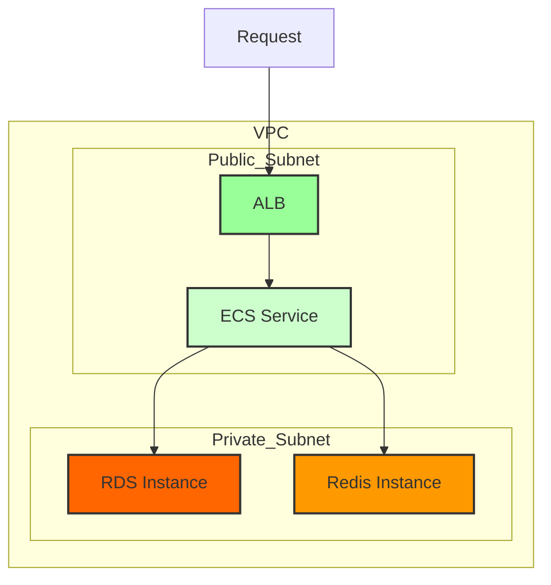

## これはなに

- Re:dash を ECS Fargate で構築するためのスクリプト

## 構成

```mermaid
graph TD;
    subgraph VPC
        subgraph Public_Subnet
            D[ALB] 
            G[ECS Service] 
        end

        subgraph Private_Subnet
            E[RDS Instance] 
            F[Redis Instance] 
        end
    end

    Public_Subnet
    Public_Subnet
    Private_Subnet 
    Private_Subnet

    Request --> D
    D --> G
    G --> E
    G --> F

    style D fill:#99ff99,stroke:#333,stroke-width:2px;
    style E fill:#ff6600,stroke:#333,stroke-width:2px;
    style F fill:#ff9900,stroke:#333,stroke-width:2px;
    style G fill:#ccffcc,stroke:#333,stroke-width:2px;
```

