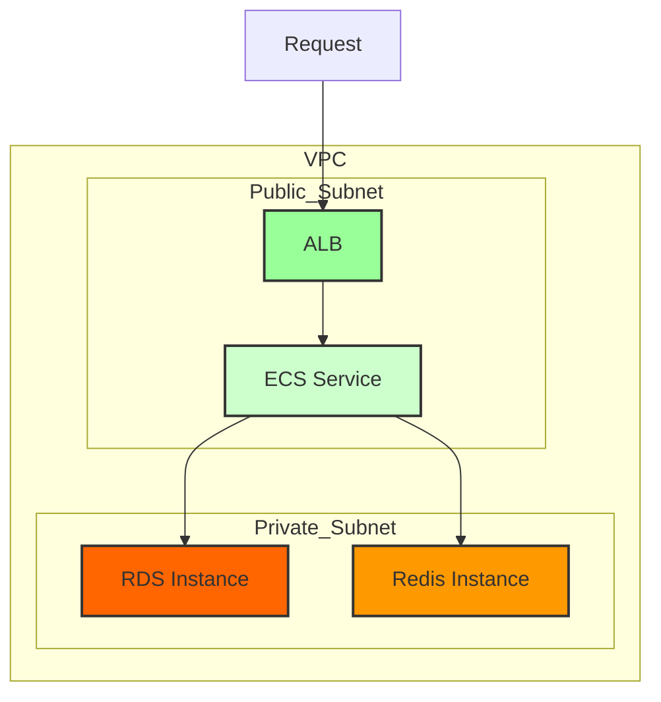

## これはなに

- Re:dash を ECS Fargate で構築するためのスクリプト

## 構成

## Google Login

1. Google Cloud Console に Project を作成
1. APIとサービス > OAuth 同意画面から情報の登録
    1. 必須項目だけ入力
    1. スコープやらはなくて大丈夫
1. APIとサービス > 認証情報からOAuth クライアント IDを作成
    1. アプリケーションの種類はウェブアプリケーション
    1. コールバックURLに CfnのOutputにある `GoogleLoginCallbackURL` を設定
1. `client_id` と `client_secret` をコピーして シークレットマネージャーに追記する

